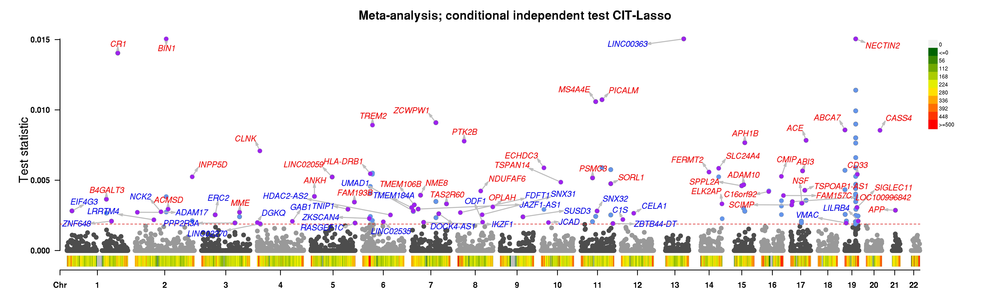
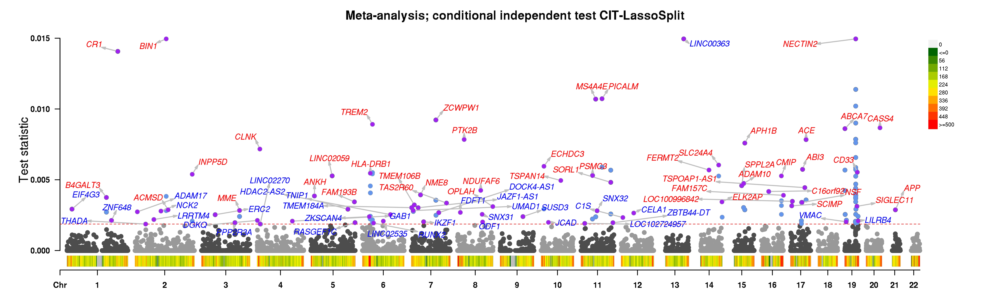
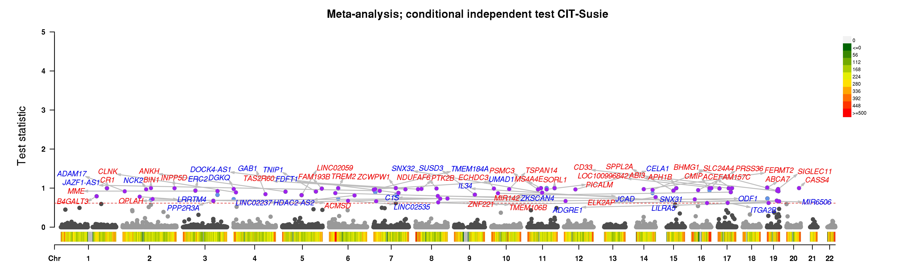
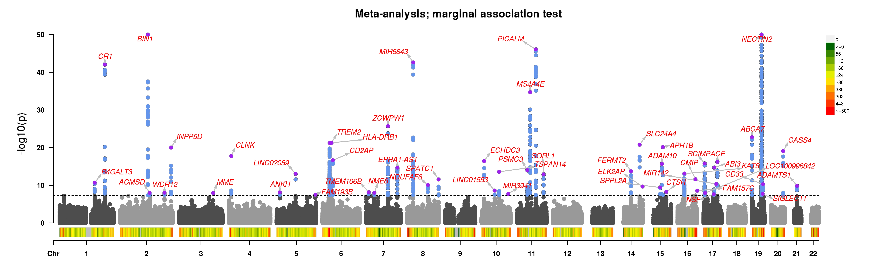

# GhostKnockoff GWAS reproducibility

This repo contains source codes used in the paper **In silico identification of putative causal genetic variants** by He et al. 



Note that code here is *purely for review purposes*. We are preparing a more robust and computationally efficient pipeline in an alternate repo which will be available within the next 1-2 months. The final repo will contain a software pipeline that is more general, easy to install, user-friendly, and scalable than the source code here. 

## Table of content

+ [Installation](https://github.com/biona001/ghostknockoff-gwas-reproducibility#installation)
    - [Installing `R` dependencies](https://github.com/biona001/ghostknockoff-gwas-reproducibility#1-installing-r-dependencies)
    - [Cloning the current repository](https://github.com/biona001/ghostknockoff-gwas-reproducibility#2-cloning-the-current-repository)
    - [Download Required Data](https://github.com/biona001/ghostknockoff-gwas-reproducibility#3-download-required-data)
+ [Example: Running the Alzheimers Diseases analyses](https://github.com/biona001/ghostknockoff-gwas-reproducibility#example-running-the-alzheimers-diseases-analyses)
+ [Example Output](https://github.com/biona001/ghostknockoff-gwas-reproducibility#example-output)
+ [Full `sessionInfo()` output](https://github.com/biona001/ghostknockoff-gwas-reproducibility#full-sessioninfo-output)
+ [Knockoff generation](https://github.com/biona001/ghostknockoff-gwas-reproducibility#knockoff-generation)
+ [Contact](https://github.com/biona001/ghostknockoff-gwas-reproducibility#contact)

## Installation

To run the provided examples, one need to 
1. Install all required `R` packages
2. Download pre-computed knockoff statistics
3. Clone the current repository

Our updated pipeline, which will be available within 1-2 months, should make these steps more streamlined, efficient, and robust. 

### 1. Installing `R` dependencies

To run the provided scripts, we need to first install the [ghostbasil](https://github.com/JamesYang007/ghostbasil) package in `R`, along with other required packages. This involves:

1. Clone the repository 
```
git clone https://github.com/JamesYang007/ghostbasil
```
2. (optional) on cluster environments, we found it necessary to load the following modules
```
module load mpfr/4.1.0 gcc/12.1.0 libgit2/1.1.0 system harfbuzz fribidi
```
3. (optional) for Mac users, 
```
brew install libomp
```
4. Within `R`, install the `ghostbasil` package
```
$ cd ghostbasil/R
$ R
> library(devtools)
> install()
```

5. Please also install the following `R` packages

+ `data.table`
+ `Matrix`
+ `susieR`
+ `rhdf5`
+ `plyr`
+ `dplyr`
+ `CMplot`

For complete list of dependencies, see [full sessionInfo() output](https://github.com/biona001/ghostknockoff-gwas-reproducibility#full-sessioninfo-output)

### 2. Cloning the current repository

```
git clone https://github.com/biona001/ghostknockoff-gwas-reproducibility.git
```

### 3. Download Required Data

Please [download this data](https://drive.google.com/file/d/1_ajlxFWE2MCSgBXDgDbeZh9Lq721WANA/view?usp=drive_link) (8.2GB) and unzip it:
```
unzip data.zip
```
If unzipping throws a warning `error: invalid zip file with overlapped components (possible zip bomb)`, then try again with 
```
UNZIP_DISABLE_ZIPBOMB_DETECTION=TRUE unzip data.zip
```

After unzipping, you will find the following files in the `data` directory:
- `EUR` directory (9.3G) contains pre-computed knockoff statistics (for EUR ancestry) stored in `.h5` format, as well as summaries for each block (please see [Knockoff generation](https://github.com/biona001/ghostknockoff-gwas-reproducibility#knockoff-generation) section below for details)
- `AD_Zscores_Meta.txt` (1.8GB) contains Z-scores and basic allelic information for 11 Alzheimer Disease studies (10 studies + 1 meta-analysis study which aggregates the 10 studies)
- `SummaryStatInfo.txt` (4KB) contains summaries for the 10 Alzheimer Disease studies (sample size, human genome build...etc)
- `topcS2GGene_allVariants.csv` (143MB) contains the nearest gene for each SNP
- `refGene_hg38.txt` (24MB) contains more gene information necessary for making Manhattan plots

## Example: Running the Alzheimers Diseases analyses

The main GhostBasil pipeline is implemented in `src/GKL_RunAnalysis_All.R` file. It can be ran via:

```shell
$ Rscript --vanilla GKL_RunAnalysis_All.R arg1 arg2 arg3 arg4 arg5 arg6
```
where 
+ `arg1`: Integer between 1 to 11 representing different Alzhimers disease studies. The first 10 studies are summarized in `data/SummaryStatInfo.txt` while study 11 is a meta-analysis of the 10 studies.
+ `arg2`: path to pre-computed knockoff statistics (see item 1 under [Download Required Data](https://github.com/biona001/ghostknockoff-gwas-reproducibility#3-download-required-data))
+ `arg3`: path to Z score file which includes Z scores as well as the chr/pos and ref/alt alleles (see item 2 under [Download Required Data](https://github.com/biona001/ghostknockoff-gwas-reproducibility#3-download-required-data))
+ `arg4`: path to summary statistics file for the different AD studies (see item 3 under [Download Required Data](https://github.com/biona001/ghostknockoff-gwas-reproducibility#3-download-required-data))
+ `arg5`: path to the cS2G file, which maps each SNP to the closet gene (see item 4 under [Download Required Data](https://github.com/biona001/ghostknockoff-gwas-reproducibility#3-download-required-data))
+ `arg6`: Output directory

For example, to run the meta-analysis GWAS result for Alzheimers Disease:

```shell
$ Rscript --vanilla GKL_RunAnalysis_All.R 11 /scratch/users/bbchu/AD_meta/data/EUR /scratch/users/bbchu/AD_meta/data/AD_Zscores_Meta.txt /scratch/users/bbchu/AD_meta/data/SummaryStatInfo.txt /scratch/users/bbchu/AD_meta/data/topcS2GGene_allVariants.csv /scratch/users/bbchu/AD_meta/Results
```

Running the example above should produce a file `results_AD_Meta_All_11.txt` in the output directory which contains various knockoff statistics. 

## Example Output

We can generate Manhattan plots via
```shell
$ Rscript --vanilla GKL_Manhattan.R arg1 arg2 arg3 arg4 arg5
```
where 
+ `arg1`: Integer between 1 to 11, this should be the first argument you used for running `GKL_RunAnalysis_All.R`
+ `arg2`: path to the original Z score file (i.e. this is argument 3 for `GKL_RunAnalysis_All.R`)
+ `arg3`: **Directory** to the output file of `GKL_RunAnalysis_All.R`, i.e. (i.e. this is argument 6 for `GKL_RunAnalysis_All.R`)
+ `arg4`: Reference gene file, this is the last downloaded item under [Download Required Data](https://github.com/biona001/ghostknockoff-gwas-reproducibility#3-download-required-data)
+ `arg5`: Output directory

For example, one can execute:

```shell
$ Rscript --vanilla GKL_Manhattan.R 11 /scratch/users/bbchu/AD_meta/data/AD_Zscores_Meta.txt /scratch/users/bbchu/AD_meta/Results /scratch/users/bbchu/AD_meta/data/refGene_hg38.txt /scratch/users/bbchu/AD_meta/Results
```

This will create several Manhattan plots similar to what was featured in our paper, e.g. 


<!-- 

 -->


## Full `sessionInfo()` output:

The pipeline was tested on Stanford's Sherlock cluster which loads the following modules 
+ `R/4.0.2`
+ `cmake/3.24.2`
+ `harfbuzz/1.4.8`
+ `fribidi/1.0.12`
+ `libgit2/1.1.0`
+ `openssl/3.0.7`

The output of `sessionInfo()`:

```R
> sessionInfo()
R version 4.0.2 (2020-06-22)
Platform: x86_64-pc-linux-gnu (64-bit)
Running under: CentOS Linux 7 (Core)

Matrix products: default
BLAS/LAPACK: /share/software/user/open/openblas/0.2.19/lib/libopenblasp-r0.2.19.so

locale:
 [1] LC_CTYPE=en_US.UTF-8       LC_NUMERIC=C              
 [3] LC_TIME=en_US.UTF-8        LC_COLLATE=en_US.UTF-8    
 [5] LC_MONETARY=en_US.UTF-8    LC_MESSAGES=en_US.UTF-8   
 [7] LC_PAPER=en_US.UTF-8       LC_NAME=C                 
 [9] LC_ADDRESS=C               LC_TELEPHONE=C            
[11] LC_MEASUREMENT=en_US.UTF-8 LC_IDENTIFICATION=C       

attached base packages:
[1] stats     graphics  grDevices utils     datasets  methods   base     

other attached packages:
[1] susieR_0.12.35    rhdf5_2.34.0      ghostbasil_0.1.3  Matrix_1.6-0     
[5] data.table_1.14.8

loaded via a namespace (and not attached):
 [1] Rcpp_1.0.10        magrittr_2.0.3     tidyselect_1.2.0   munsell_0.5.0     
 [5] colorspace_2.1-0   lattice_0.20-41    R6_2.5.1           rlang_1.1.0       
 [9] fansi_1.0.4        plyr_1.8.9         dplyr_1.1.1        tools_4.0.2       
[13] grid_4.0.2         gtable_0.3.3       utf8_1.2.3         irlba_2.3.5.1     
[17] cli_3.6.1          matrixStats_0.63.0 tibble_3.2.1       lifecycle_1.0.3   
[21] crayon_1.5.2       mixsqp_0.3-48      Rhdf5lib_1.12.1    ggplot2_3.4.2     
[25] vctrs_0.6.1        rhdf5filters_1.2.1 codetools_0.2-16   glue_1.6.2        
[29] pillar_1.9.0       compiler_4.0.2     generics_0.1.3     scales_1.2.1      
[33] reshape_0.8.9      pkgconfig_2.0.3
```

## Knockoff generation

Because pre-computed knockoff statistics are available for download, users do not have to manually install `EasyLD.jl` nor `Knockoffs.jl` to carry out this step.

+ Processing of LD panels (including downloading and importing the data matrices) is carried out by an independent software [EasyLD.jl](https://github.com/biona001/EasyLD.jl).
+ Knockoff optimization problem was carried out by [Knockoffs.jl](https://github.com/biona001/Knockoffs.jl). 

If one wishes to carry out customized knockoff analysis pipeline, feel free to reach out to us for assistance. 

## Contact

For questions regarding this repo, please reach out to Zihuai He (`zihuai@stanford.edu`) or Benjamin Chu (`bbchu@stanford.edu`). 
