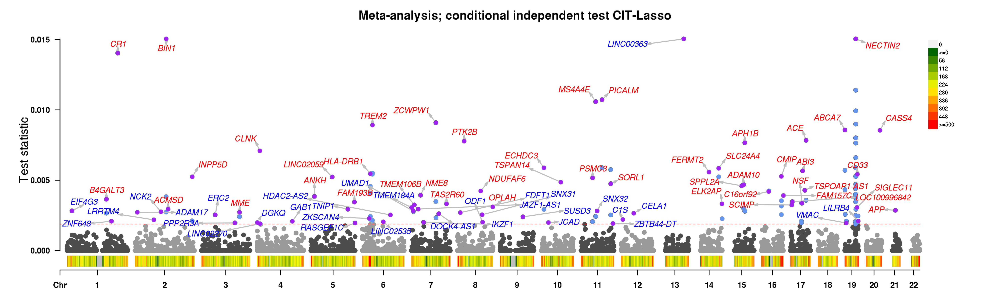

# Reproducibility scripts for analyzing GWAS summary statistics via GhostKnockoffs

:warning: Note these source codes are *purely for review and reproducibility purposes*. Users interested in running the overall pipeline should proceed to the main [CITLasso page](https://github.com/biona001/CITLasso). 

In a series of three papers, we show how the GhostKnockoff framework enables a knockoff-based analysis of GWAS summary statistics data with enhanced power compared to standard GWAS pipelines (e.g. LMM + SuSiE). The main methodology is described in the following papers

1. **Controlled Variable Selection from Summary Statistics Only? A Solution via GhostKnockoffs and Penalized Regression** by Chen et al, with source code available under the *chen_et_al* folder.
2. **Second-order group knockoffs with applications to GWAS** by Chu et al, with source code available in the *chu_et_al* folder. 
3. **Beyond guilty by association at scale: searching for causal variants on the basis of genome-wide summary statistics** by He et al, with source code available under the *he_et_al* folder.

## Contact

For questions regarding this repo, please reach out to Zihuai He (`zihuai@stanford.edu`), Benjamin Chu (`bbchu@stanford.edu`), or Zhaomeng Chen (`zc313@stanford.edu`).
